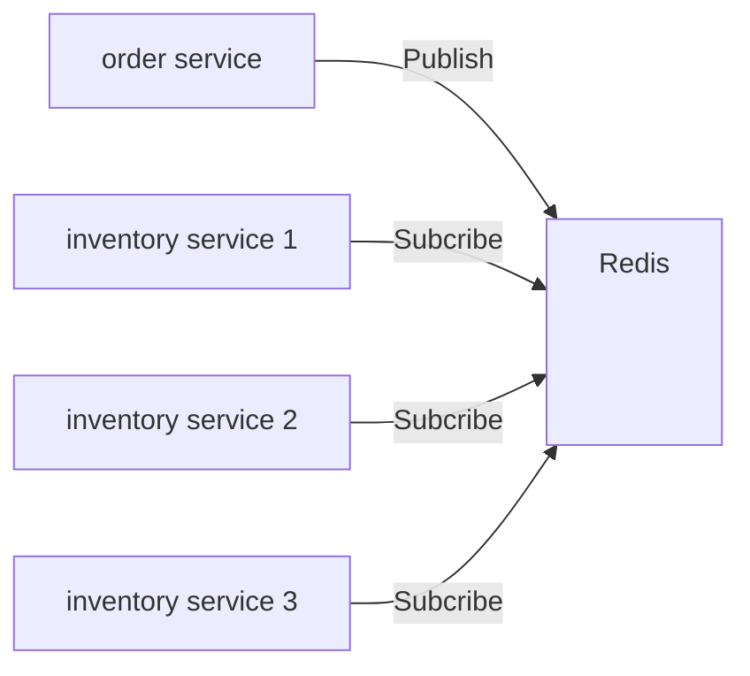
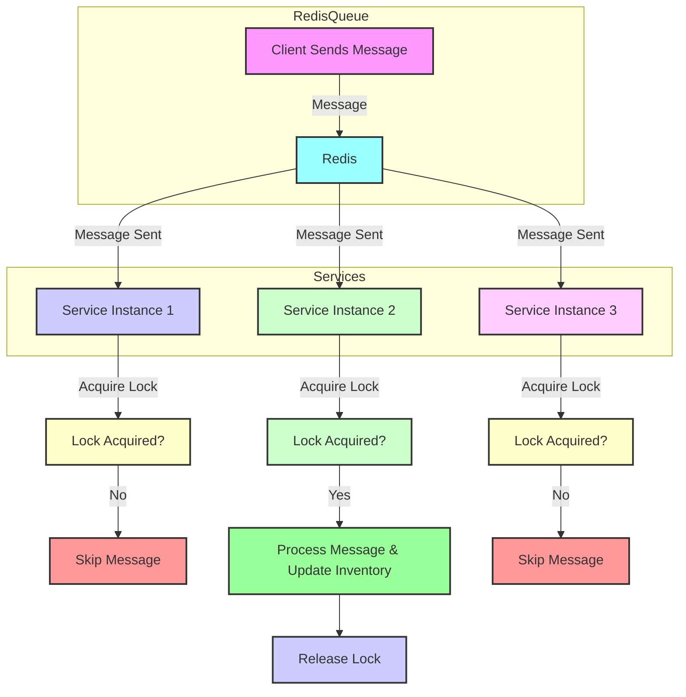
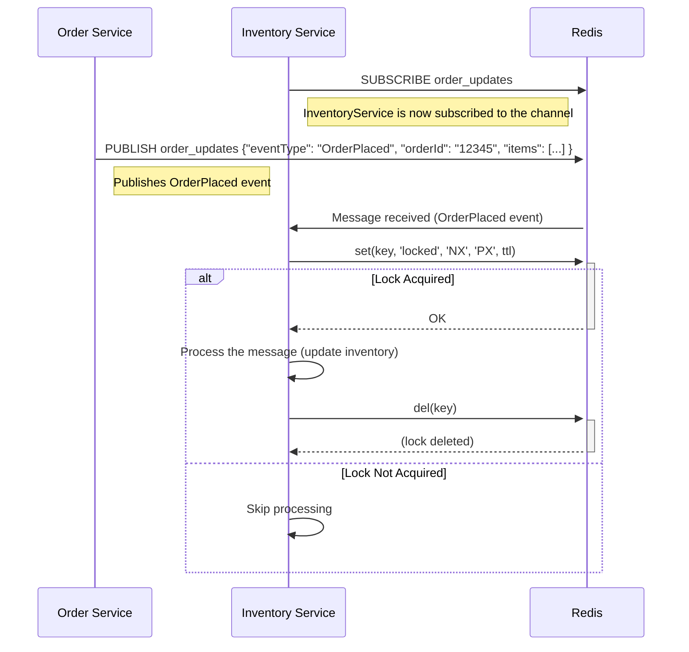

# NestJS Redis Exactly-Once Processing

Full article can be found [here](https://kelvinbz.medium.com/ensuring-exactly-once-message-processing-in-nestjs-with-redis-pub-sub-bcdd293d38f9?postPublishedType=initial)


This project demonstrates a solution for exactly-once message processing using Redis Pub/Sub with distributed locks in a NestJS application. The goal is to ensure that multiple instances of the service receive the same message, but only one instance processes it.





## Order Service: Publishing Messages to Redis

```typescript
// order/src/order/order.service.ts
import { Injectable } from '@nestjs/common';
import { RedisService } from '../redis/redis.service';

@Injectable()
export class OrderService {
  constructor(private readonly redisService: RedisService) {}

  async placeOrder(order: any) {
    // Create a unique order ID
    const orderId = new Date().getTime().toString();
    const orderMessage = JSON.stringify({ id: orderId, ...order });
    // Publish order message to Redis channel
    await this.redisService.publishMessage('order_updates', orderMessage);
  }
}
```

## Inventory Service: subscribes to the order_updates channel and processes messages

```typescript
// inventory/src/redis/redis.service.ts
import { Injectable, Logger, OnModuleInit } from '@nestjs/common';
import { InjectRedis } from '@nestjs-modules/ioredis';
import { promisify } from 'util';
import Redis from 'ioredis';
import { InventoryService } from '../inventory/inventory.service';

@Injectable()
export class RedisService implements OnModuleInit {
    private readonly logger = new Logger(RedisService.name);

    constructor(
        @InjectRedis() private readonly redis: Redis,
        private readonly inventoryService: InventoryService,
    ) {}

    onModuleInit() {
        this.subscribeToChannel('order_updates');
    }

    async publishMessage(channel: string, message: string) {
        await this.redis.publish(channel, message);
    }

    private async subscribeToChannel(channel: string) {
        const subscriber = this.redis.duplicate();

        subscriber.on('message', async (channel, message) => {
            this.logger.log(`Received message from ${channel}: ${message}`);
            await this.handleMessage(message);
        });

        await subscriber.subscribe(channel);
    }

    private async handleMessage(message: string) {
        const messageId = this.extractMessageId(message);
        const lockKey = `lock:${messageId}`;

        if (await this.acquireLock(lockKey)) {
            try {
                // Process the message here
                this.logger.log(`[handleMessage] Processing message: ${message}`);
                // Simulate message processing
                await this.inventoryService.updateInventory();
            } finally {
                await this.releaseLock(lockKey);
            }
        } else {
            this.logger.log(
                `[handleMessage] Skipping duplicate message: ${messageId}`,
            );
        }
    }

    private extractMessageId(message: string): string {
        // Extract a unique message ID from the message
        return JSON.parse(message).id;
    }

    private async acquireLock(key: string, ttl = 5000): Promise<boolean> {
        const setAsync = promisify(this.redis.set).bind(this.redis);
        const result = await setAsync(key, 'locked', 'NX', 'PX', ttl);
        return result === 'OK';
    }

    private async releaseLock(key: string) {
        await this.redis.del(key);
    }
}


```

When an instance of the InventoryService receives a message, it tries to acquire a lock with a TTL of 5 seconds.

**Generating Lock Key**: The lock key is generated using a unique identifier from the message, ensuring each message can be tracked and locked individually.

**Acquiring Lock**: A lock is acquired by setting a key in Redis with the NX (only set if not exists) and PX (set expiration time) options.

**Releasing the Lock**: Once message processing is complete, the lock is released by deleting the key from Redis.


TTL ensures that locks do not persist indefinitely. If a service instance crashes or fails to release the lock, the TTL guarantees that the lock will eventually expire and become available for other instances.

By setting a reasonable TTL, you can ensure that locks are held only for the duration necessary to process a message. This prevents long delays in message processing due to stale locks.

## Verifying the Setup

1. **Register for Redis** : Go to Redis Cloud and sign up for a free account.
2. **Register for Datadog**: Go to Datadog. Set up an API key from the API section of your Datadog account.
3. **Deploying inventory** and order service with helm: helm files can be found at :

```bash
inventory/helm
order/helm
```

`values.yaml` file to deploy three instances of the inventory service:


```yaml
# inventory/helm/values.yaml
replicaCount: 3
```
Make requests to the order service:

```bash
POST http://localhost:3001/orders
Content-Type: application/json

{
  "orderId": "29",
  "items": [
    {
      "id": "001",
      "quantity": 2
    },
    {
      "id": "002",
      "quantity": 1
    }
  ]
}
```

Logs from the inventory service instances are collected by Datadog. Only one instance processes each message, and this can be verified through the logs:


By following these steps, you ensure that only one instance of your service processes each message exactly once, preventing duplicate processing and ensuring data consistency.

## Considerations for Implementing Exactly-Once Processing:

By following this approach, we ensure that messages are processed exactly once in a distributed environment, preventing duplicate processing and maintaining data consistency

While Redis with distributed locks is a viable solution for ensuring exactly-once message processing, it comes with considerations and potential drawbacks. Evaluating alternative methods such as Apache Kafka, idempotent operations, database-based locks, and managed cloud services like AWS SQS/DynamoDB can help in selecting the best approach for your specific use case. Each method has its own set of trade-offs in terms of complexity, performance, scalability, and cost.
